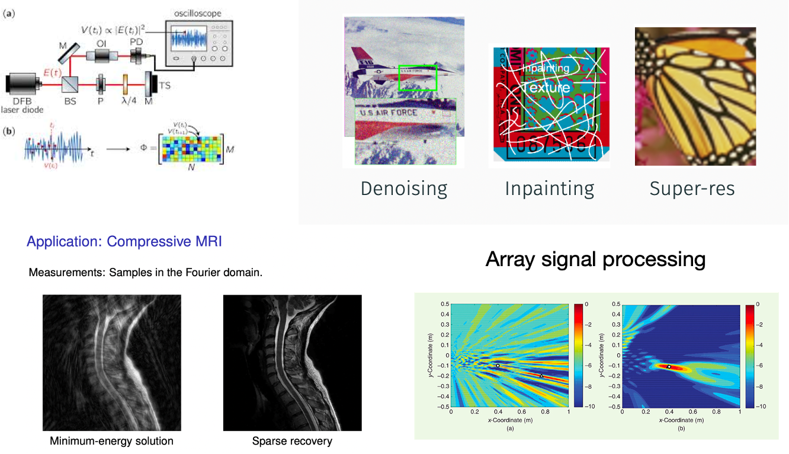
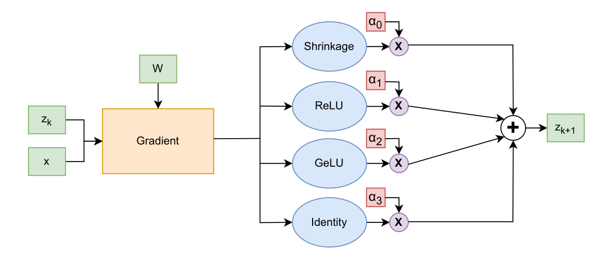
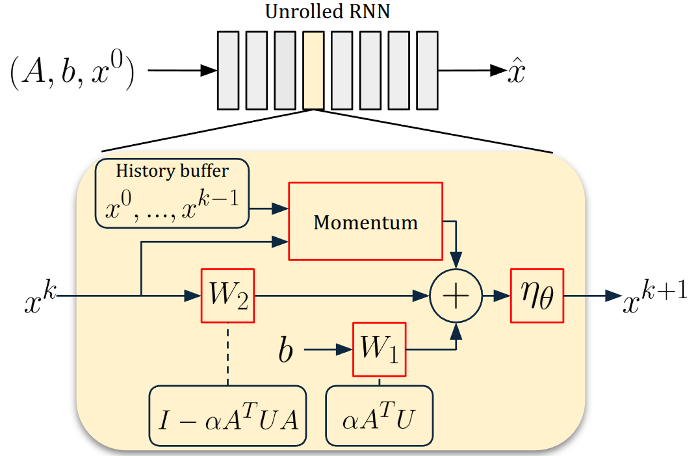
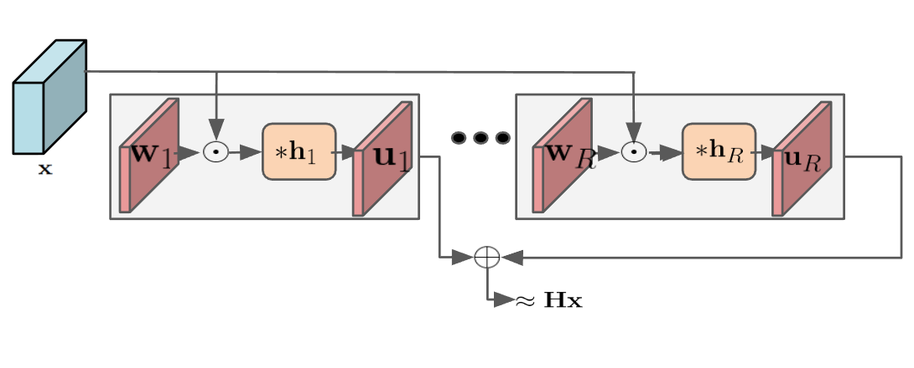

## Overview

This repository aims to automate the discovery of algorithms through the use of various machine learning techniques. We focus on sparse recovery algorithms due to their many applications and a rich theoretical understanding of these algorithms. This situates sparse recovery algorithms as the perfect sandbox for testing out frameworks aimed at algorithm discovery. 

<center>

</center>

## [**NAS FISTA**](fista_nas)

We rediscover FISTA by creating sufficiently large DARTS cells and have the model learn operations matching the FISTA algorithm's operations. The main choices to consider are the proximal operator (shrinkage), the gradient's choice for acceleration (momentum), and the number of layers in our model (iterations of the algorithm). 

<center>

</center>


## [**Momentum and Preconditioning**](acceleration_discovery)
We also investigated two possible approaches for discovery of acceleration: (1) Add **momentum** terms in the unrolled network, which are equivalent to adding the skip connections in the network. (2) Add a **preconditioning** operator in the forward/adjoint steps.

<center>

</center>

## [**Shift Varying Systems**](shift_varying_system_discovery/)
Sparse recovery algorithms rely on a well-defined forward model of the problem. However, many practical imaging applications, such as shift-varying blur and atmospheric turbulence, involve shift-varying systems that are computationally expensive to model directly. Storing the full forward operator in these cases is often infeasible. The goal of this experiment is to explore and learn efficient modeling approaches for these systems.

<center>

</center>

## **Citation**
```
@misc{disco,
  author = {Sarthak Gupta, Yaoteng Tan, Nebiyou Yismaw, Patrick Yubeaton, Salman Asif, Chinmay Hegde},
  month = april,
  title = {{DISCO: Discovery of Sparsity Constrained Optimization Algorithms}},
  year = {2025}
```
