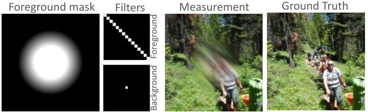

# Shift-Varying Systems Using CNNs

This repository implements an efficient model for **shift-varying systems** based on convolutional neural networks (CNNs) and an unrolled optimization method. The approach models a shift-varying operator as a combination of spatially varying weight maps and convolution kernels (PSFs).


 A simple shift-varying system as a result of object motion is shown below. The first column shows the foreground mask. In the second column top-row, we show the bluring filter that is applied according to the foreground mask. The pass-through filter for the background scene is shown in the second column second row.



## Model Overview

The forward model is approximated as:

$$
H x \approx \sum_{p=1}^P \text{conv}(c_p^\star) \cdot \text{diag}(w_p^\star) x,
$$

Where:
- $ \text{conv}(c_p^\star) $ is the convolution with the $ p $-th point spread function (PSF),
- $ w_p^\star $ is the spatially varying weight map associated with the $ p $-th kernel.

The adjoint of this operator is expressed as:

$$
H^\top x = \sum_{p=1}^P \text{diag}(w_p^\star) \cdot \text{conv}(\bar{c}_p^\star) x,
$$

Where $ \bar{c}_p^\star $ represents the flipped version of the kernel $ c_p^\star $.

## CNN-Based Implementation

### Steps to Implement:

1. **Weight Maps**  
   - Store the spatially varying weights $ w_p^\star $ in a tensor of shape `[P, H, W]`, representing the pixel-wise contribution of each kernel.
   - These weight maps are typically sparse, as the PSFs are localized.

2. **PSF Kernels**  
   - Each $ c_p^\star $ is treated as a separate convolution kernel. Define a convolutional layer with $ P $ filters, each corresponding to one PSF.

3. **Windowed Convolution**  
   - The model computes the operator by modulating the input with the weight maps and performing convolution:
   
   $$
   H x \approx \sum_{p=1}^P (x \odot w_p^\star) \otimes c_p^\star,
   $$

   Alternatively, we use the following formulation:

   $$
   H x \approx \sum_{i=1}^R (x \odot w_i) \otimes k_i.
   $$

## Learning Setup

The model uses **unrolled optimization** with the FISTA (Fast Iterative Shrinkage-Thresholding Algorithm) method for training.

### Main Steps:

1. **Initialization**  
   - Initialize the convolutional filters $ \{ c_p^\star \} $ and weights $ \{ w_p^\star \} $.

2. **FISTA Update**  
   - At each iteration $ k $, update the current estimate $ x^{(k)} $ using:

   $$
   x^{(k+1)} = \text{prox}_{\lambda R}(x^{(k)} - \eta \nabla f(x^{(k)})),
   $$

   where $ R $ is the regularization term and $ f $ is the data fidelity term.

3. **Reconstruction Loss**  
   - Calculate the reconstruction loss as:

   $$
   \mathcal{L}_\text{recon} = \| x_\text{recon} - x_\text{true} \|_2^2.
   $$

4. **Backpropagation**  
   - Use the reconstruction loss to update both the convolutional filters and spatial weight maps.

## Usage

Here is an example train command to learn the 2 PSFS of motion kernel.

```bash
python3 main_shift_varying.py --dataset div2k \
--kernel_size 15 --learning_rate 5e-4 --learning_rate_weights 5e-4 --fista_step_size 5e-1 --num_psfs 2 \
--one_step_meas --meas_loss_alpha 1 --one_step_meas_val --num_layers 1 \
--num_imgs 128 --kernel_type motion
```
Key Commands:
- `--kernel_type`: Forward operator type. Our current results and experiments focus on `motion` kernel type (as shown above).Specifies the type of measurement blur. Options are:
  - `oriented`
  - `blended` (default)
  - `random`
  - `motion`
  - `gaussian`
  - `MLA`
- `--weight_l1_alpha`: Sets the sparsity constraint L1 alpha for the weights. (Default: `0`)
- `--num_psfs`: Defines the number of PSFs (Point Spread Functions) to learn. (Default: `2`)
- `--kernel_size`: Specifies the kernel size to be used. (Default: `13`)

- `--banded_matrix_width`: Defines the width of the banded matrix. (Default: `-1`)


For additional commands and options, run the following to see the full list:
```
python3 main_shift_varying.py --help
```
